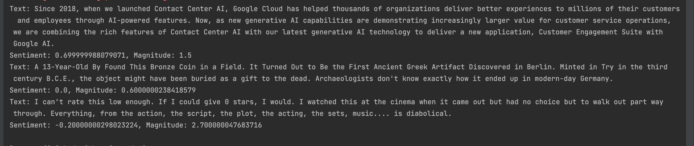

# Text Analysis Project

A Python project demonstrating Google Cloud AI services for text and speech processing.

## Overview

This project showcases the integration of Google Cloud AI services including:
- **Natural Language API** for sentiment analysis
- **Speech-to-Text API** for audio transcription
- **Text-to-Speech API** for speech synthesis

## Files

### Core Scripts

- **`TextAnalysis.py`** - Demonstrates sentiment analysis using Google Cloud Natural Language API
- **`speech-to-text.py`** - Converts audio files to text using Speech-to-Text API
- **`text-to-speech.py`** - Converts text to speech using Text-to-Speech API

### Resources

- **`resources/`** - Directory containing audio files:
  - `virtual_vibes-peaceful-morning-birds-383856.mp3` - Sample audio for transcription
  - `output.mp3` - Generated speech from text
  - `output_ssml.mp3` - Generated speech with SSML markup

## Setup

### Prerequisites

1. Python 3.10+
2. Google Cloud project with the following APIs enabled:
   - Cloud Natural Language API
   - Cloud Speech-to-Text API
   - Cloud Text-to-Speech API

### Installation

1. Create a virtual environment:
```bash
python -m venv venv
source venv/bin/activate  # On Windows: venv\Scripts\activate
```

2. Install required packages:
```bash
pip install google-cloud-language google-cloud-speech google-cloud-texttospeech
```

3. Set up Google Cloud authentication:
```bash
gcloud auth application-default login
```

### Configuration

Update the `PROJECT_ID` and `LOCATION` variables in `speech-to-text.py`:
```python
PROJECT_ID = "your-project-id"
LOCATION = "us-east1"  # or your preferred region
```

## Usage

### Text Analysis

Run the sentiment analysis script:
```bash
python TextAnalysis.py
```

This will analyze sentiment for three sample texts and output sentiment scores and magnitudes.

#### Analysis Results



The sentiment analysis provides:
- **Score**: Ranges from -1.0 (negative) to 1.0 (positive)
- **Magnitude**: Indicates the overall emotional strength (0.0 to inf)

### Speech-to-Text

Transcribe audio files:
```bash
python speech-to-text.py
```

This will process all audio files in the `resources/` directory and output their transcriptions.

### Text-to-Speech

Generate speech from text:
```bash
python text-to-speech.py
```

This will create two audio files:
- `resources/output.mp3` - Basic text-to-speech
- `resources/output_ssml.mp3` - Speech with SSML markup for enhanced control

## Features Demonstrated

### Natural Language API
- Sentiment analysis with score and magnitude
- Entity recognition (framework ready)
- Content classification (framework ready)

### Speech-to-Text API
- Audio file transcription
- Auto-detection of audio format
- Multiple audio file processing

### Text-to-Speech API
- Basic text synthesis
- SSML markup for advanced speech control
- Voice customization (language, gender, name)
- Audio parameters (rate, pitch, volume)

## Project Structure

```
TextAnalysis/
├── .gitignore
├── README.md
├── TextAnalysis.py
├── speech-to-text.py
├── text-to-speech.py
├── resources/
│   ├── virtual_vibes-peaceful-morning-birds-383856.mp3
│   ├── output.mp3
│   └── output_ssml.mp3
└── venv/
```

## Notes

- Audio files should be kept under 30 seconds for optimal performance
- The project uses the "short" model for speech recognition
- SSML allows for fine-grained control over speech synthesis
- Ensure your Google Cloud project has billing enabled for API usage

## Dependencies

- `google-cloud-language>=2.0.0`
- `google-cloud-speech>=2.0.0`
- `google-cloud-texttospeech>=2.0.0`
